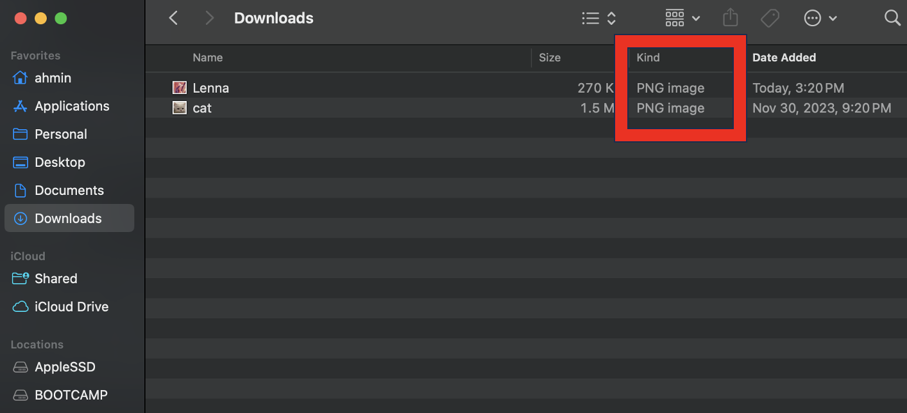
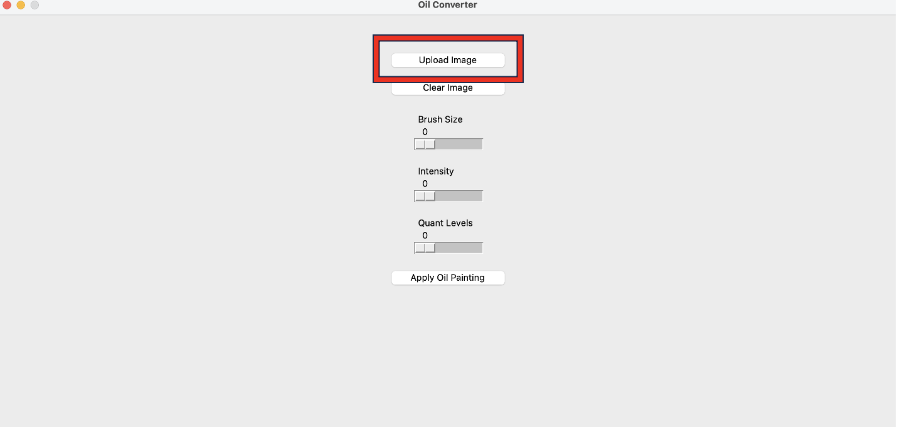
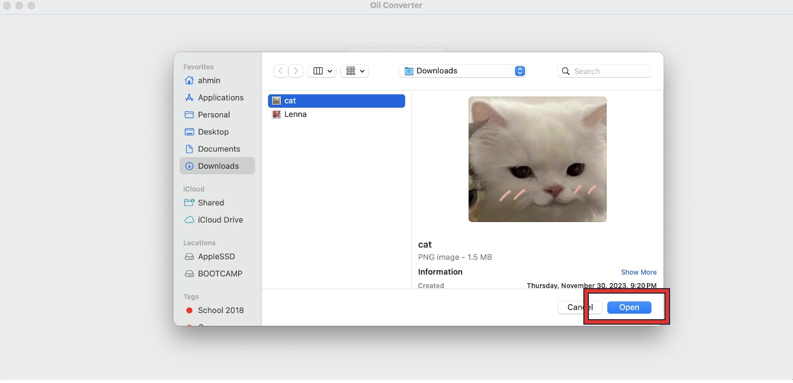
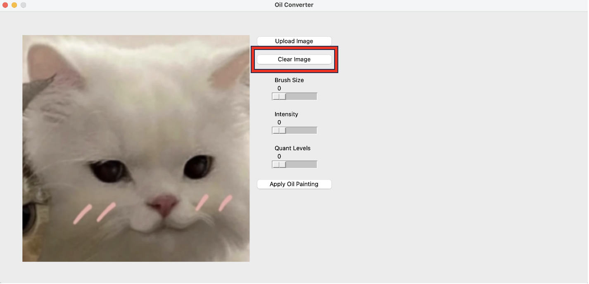
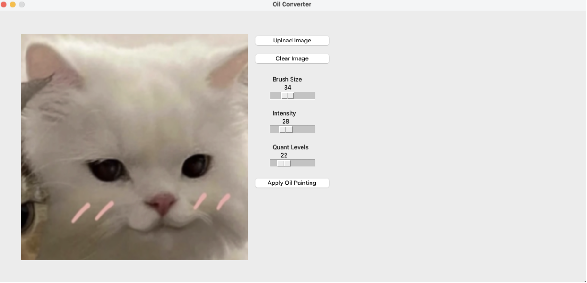
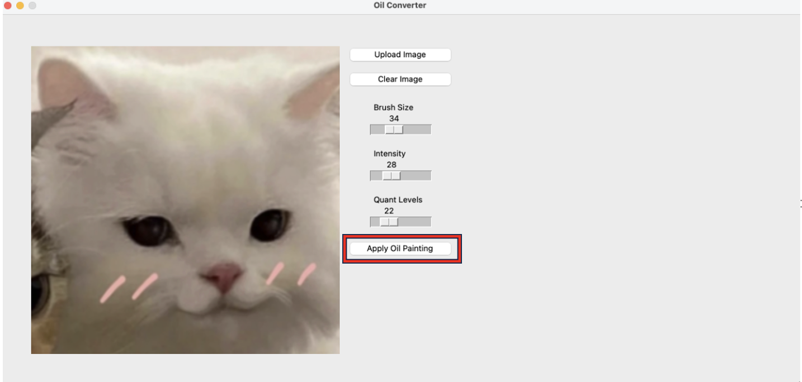

# Introduction 
The goal of this project was to showcase my ability to identify, formulate, and solve image processing problems while performing a real-time demonstration of an image processing example. From this project, I have developed a simple graphic user interface (GUI) that can load an image, apply an image processing technique, and display the input/output result. Specifically, I have designed a combination of image processing techniques to have my application take any image and output it as an oil style drawing. 

# Objective 
The objective of this project is to derive an “oil painting” like output given an input image. Specifically, the output image should have a unique texture that appears a bit rough and thick to mimic that of a dynamic and impressionistic effect. In my project, I tried to emphasize the effects by focusing on brush size strokes, intensity, and quantization level. 

# How to run code
1. Save any photo(s) and esure the image file format is .PNG, .JEPG, or BMP

2. Press “Upload Image” button

3. A file directory will show up indicating which file you would like to upload, press "open" when you have found the image to upload

4. If the file you have uploaded is not the desired file, press “Clear Image” and repeat steps 2-3

5. Once the image is uploaded, use the scroll bars “Brush Size”, “Intensity”, and “Quant Levels” to manipulate the three categories

6. After deciding values from the scroll bars, click “Apply Oil Painting” and watch the magic happen

7. If you decide to upload a new file, restart and complete step 2-6

# Implementation Details - GUI
The function named get_file_path utilizes a file dialog to prompt the user to select a file and returns the selected file's path. 
```
def get_file_path():
    file_path = filedialog.askopenfilename(filetypes=[])
    return file_path
```

The function named upload_image that uses the get_file_path function to obtain a file path from the user. If a valid file path is obtained, it opens the image file, resizes it to 500x500 pixels, and displays it in a graphical user interface. The image was intentionally constrained to a 500x500 pixel resolution to optimize computational efficiency during image processing, resulting in quicker outputs. 
```
def upload_image():
    file_path = get_file_path()

    if file_path:
        original_image = Image.open(file_path)
        original_image = original_image.resize((500, 500))
        original_photo = ImageTk.PhotoImage(original_image)

        original_image_label.config(image=original_photo)
        original_image_label.image = original_photo
        original_image_label.file_path = file_path
        original_image_label.place(x=50, y=50)

        altered_image_label.config(image=None)
        altered_image_label.image = None
```

The clear_image function resets the display of both original_image_label and altered_image_label in a graphical user interface.
```
def clear_image():
    original_image_label.config(image=None)
    original_image_label.image = None
    original_image_label.file_path = None

    altered_image_label.config(image=None)
    altered_image_label.image = None

```

The code below disables the resizability while setting the window size to 1300 x 600. The goal of creating a restrictive limit was to optimize computational efficiency during image processing, resulting in quicker outputs. 
```
    window_width = 1300
    window_height = 600
    root.geometry(f"{window_width}x{window_height}")
    root.resizable(False, False)

```

The code below labels for displaying original and altered images, buttons for uploading and clearing images, sliders for adjusting brush size, intensity, and quantization levels, and a button for applying an oil painting effect. The layout is organized with appropriate padding to enhance the visual presentation in the root window.
```
    original_image_label = tk.Label(root)
    original_image_label.pack(pady=10)

    altered_image_label = tk.Label(root)
    altered_image_label.pack(pady=10)

    button_width = 15 
    upload_button = tk.Button(root, text="Upload Image", command=upload_image, width=button_width)
    upload_button.pack(pady=10)

    clear_button = tk.Button(root, text="Clear Image", command=clear_image, width=button_width)
    clear_button.pack(pady=10)

    brush_size_var = tk.IntVar()
    brush_size_slider = tk.Scale(root, from_=0, to=100, orient="horizontal", variable=brush_size_var, label="Brush Size")
    brush_size_slider.pack(pady=10)

    intensity_var = tk.IntVar()
    intensity_slider = tk.Scale(root, from_=0, to=100, orient="horizontal", variable=intensity_var, label="Intensity")
    intensity_slider.pack(pady=10)

    quantization_levels_var = tk.IntVar()
    quantization_levels_slider = tk.Scale(root, from_=0, to=100, orient="horizontal", variable=quantization_levels_var, label="Quant Levels")
    quantization_levels_slider.pack(pady=10)

    apply_button = tk.Button(root, text="Apply Oil Painting", command=apply_oil_painting, width=button_width)
    apply_button.pack(pady=10)
```
